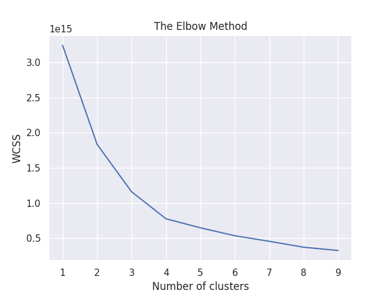
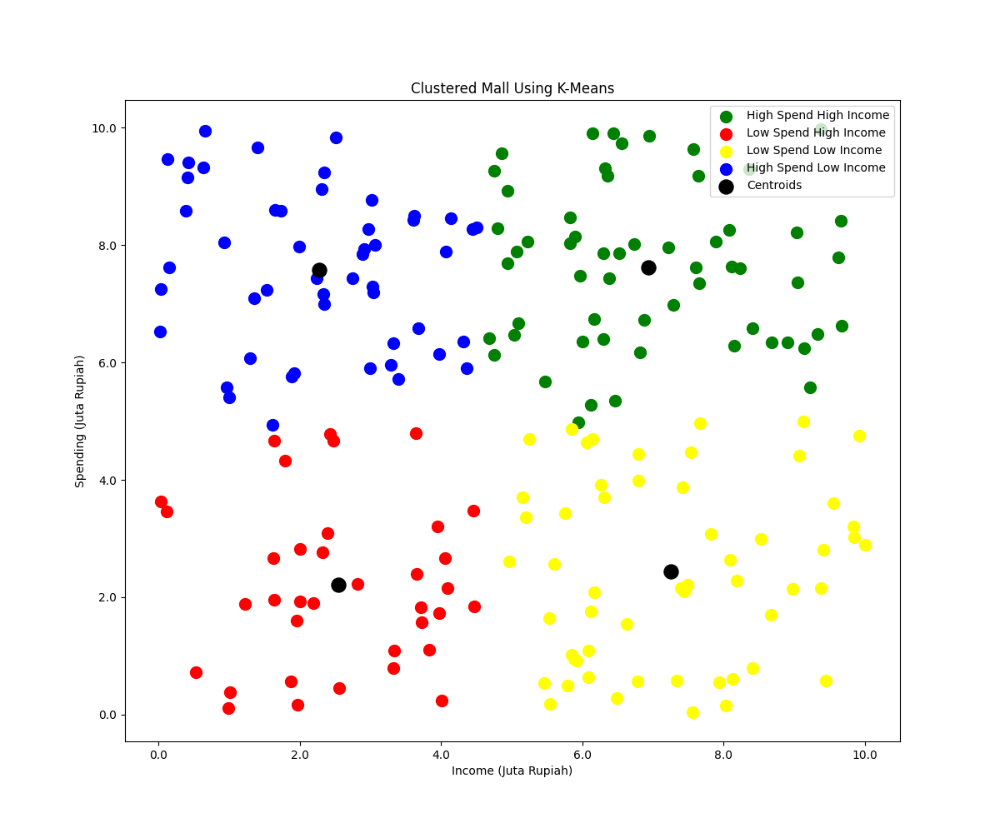

# k-means-clustering

  

  
  

<h1 align="center">
  hey there
  
</h1>

### :dart: Goals :
> Customer analysis by clustering customers based on the Income and Spending they spend while shopping and determining the number of cluster data clustering.

### :newspaper: Documentation :
1. Generate sample data in [create-data.py](create-data.py) using faker with 200 data results in [input_data/sales_data.csv](input_data/sales_data.csv)
2. Determine optimum cluster number for raw data in [calculate-elbow.ipynb](calculate-elbow.ipynb) using elbow method, with the output of the elbow method results below

    

3. From the output above the silhouette show the best cluster number are 4
4. Create clustering data points in [k-means-cluster.ipynb]() based on similarities in their features with the results below

    

5. From the graphic output above with 4 cluster we can conclude
    - There are people that have high spend with high income which are shown in green clusters, we must maintain cluster of these people.
    - There are people that have low spend with high income which are shown in red clusters, cluster of these people is the main target of our customer.
    - There are people that have low spend with low income which are shown in yellow clusters, cluster of these people is the secondary target of our customer.
    - There are people that have low spend with high income which are shown in blue clusters, cluster of these people is easly maintain with promo.